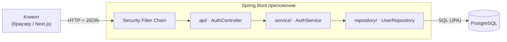
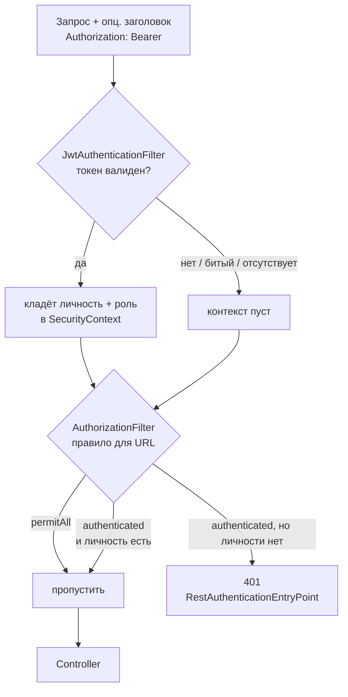
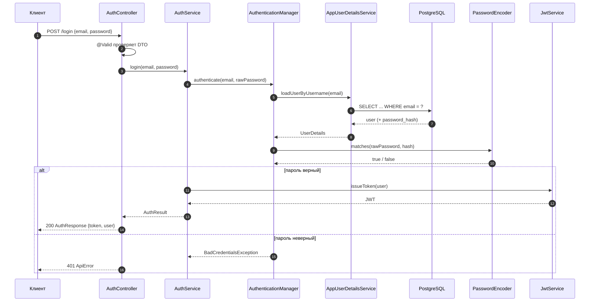
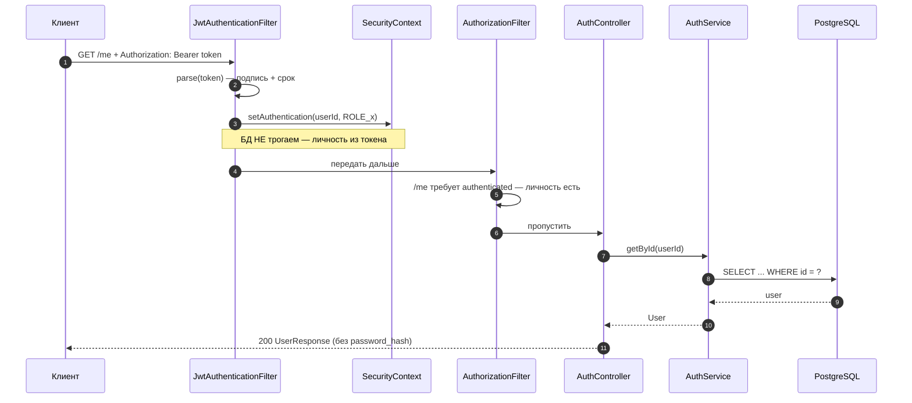
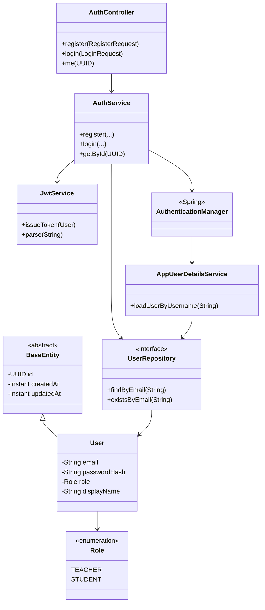
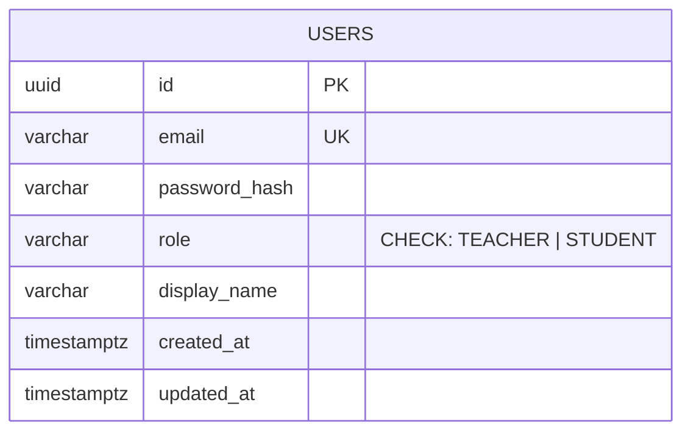

# Диаграммы — Фаза 0 (auth)

> Диаграммы в формате **Mermaid** (текст → картинка). На GitHub рендерятся сами.
> Локально в VS Code: расширение **Markdown Preview Mermaid Support** + превью `Ctrl+Shift+V`.
> Дополняют словесный разбор [`phase-0-auth.md`](phase-0-auth.md).

---

## 1. Модульный монолит: слои и поток запроса

Зависимости идут внутрь: `api → service → repository → domain`. Контроллер не лезет в БД напрямую.

---

## 2. Цепочка фильтров: аутентификация → авторизация

Аутентификация («кто ты» + роли) — раньше; авторизация («что можно») — позже, иначе нечего проверять.

---

## 3. Дверь №1 — `POST /api/auth/login` (проверка пароля по БД)

---

## 4. Дверь №2 — `GET /api/auth/me` (проверка токена, БД не для личности)

Сравни 3 и 4: логин сверяет пароль **по базе**; `/me` проверяет **токен**, а в базу идёт лишь за данными профиля.

---

## 5. Классы модуля auth (упрощённо)

> Показаны домен и связка сервисов. Конфиг/фильтры (`SecurityConfig`, `JwtAuthenticationFilter`)
> опущены для читаемости — они «обвязка», см. диаграммы 2–4.

---

## 6. Схема БД: таблица `users`

По мере фаз сюда добавятся `courses`, `groups`, `problems`, `submissions` и связи между ними.
